# Walkthrough: TriMedX Okta setup

The goal of this document is to provide instructions regarding the third-party authorization API setup.
>Note: It is strongly recommended to read all deployment-related documents to understand how the settings are interconnected and mutually dependent

## Prerequisites

1. Okta account
2. Visual Studio Community Edition 17.5, or any IDE, or text editor, even Notepad

## Sign Up for Okta
You’ll need a free Okta developer organization to get started. 

TriMedX Okta developer organization: https://trimedx.oktapreview.com
Ask your network administrator for credentials.

If you don’t have one already, sign up to create one here https://developer.okta.com/signup/
When you create a new Okta organization, it will be assigned a base URL like `dev-12345.oktapreview.com`. This is your unique subdomain in Okta. `oktapreview.com` orgs are production-ready and can be used for development work or full-fledged apps.


## Set up and tweak an application

The settings that we tune in this section are interconnected with the deployment IIS MAnagement settings. It means, that the sites and ports you enter here should be the same as the sites and ports you enter in IIS Manager setup. 

>Note: The Application for https://trimedx.oktapreview.com account is already set up

1. Open 'Applications' menu
2. Click Add application button

3. Choose **WEB** container and click **Next**
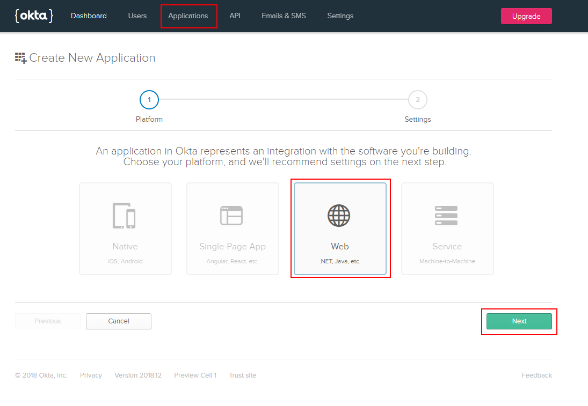
4. Add **Base URIs**. These are the domains where your application runs. Trusted Origins will be created for these URIs automatically, and will be the only domains Okta accepts API calls from. Use your CAM Portal URI and Admin Portal URI including ports that will be used during the deployment procedure. 
Example: 
http://localhost:54478/ (Admin)
http://localhost:54477/ (CAM)
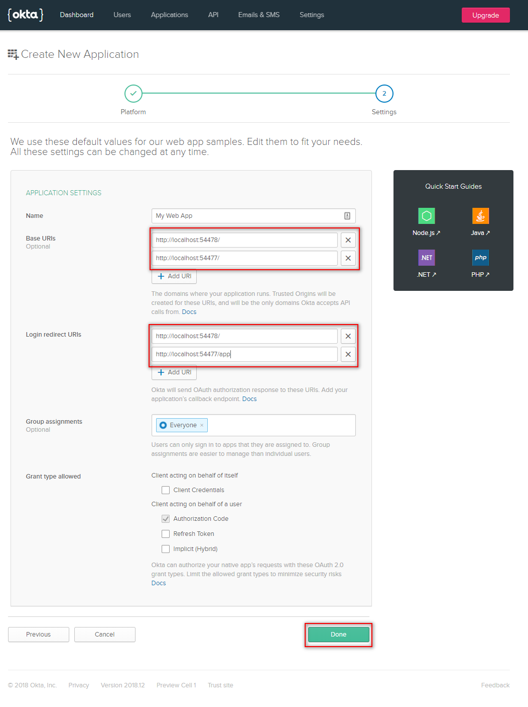
5. **Login redirect URIs**:
    1. Add base Admin Portal URI, e.g. http://localhost:54478/
    2. Add CAM Portal login redirect, e.g. http://localhost:54477/app. It means that the `localhost:54477` should be substituted with the relevant `address:port` and after it added `/app`
6. For **Grant type allowed** check
    1. 'Authorization Code'
    2. 'Refresh Token
    3. 'Implicit (Hybrid)''
7. Click **Done**

Your application will appear in the list of apps. You can easily access it by click on Applications menu item in the header

Choose your app in the list of applications to tweak its settings, click **Edit**
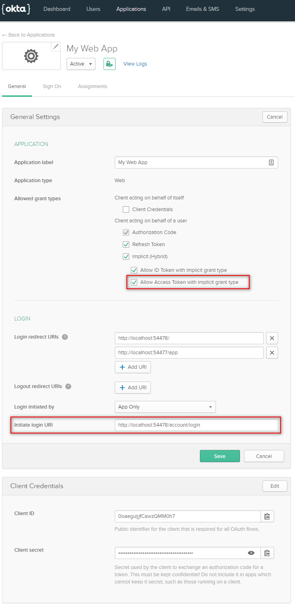

1. In the **Allowed grant types** group of settings, tick **Allow Access Token with implicit grant type**
2. In the **Initiate login URI**, add login URI for Admin portal, e.g. http://localhost:54478/account/login. It means that the `localhost:54478` should be substituted with the relevant `address:port` and after it added `/account/login`

The next step is to check the Trusted Origins. To do so you need to click **API** menu item and choose **Trusted origins** in the dropdown 
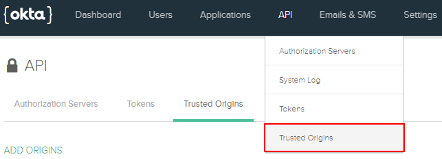

If you added **Base URIs** while setting up your application, the trusted origins will be on the list. 
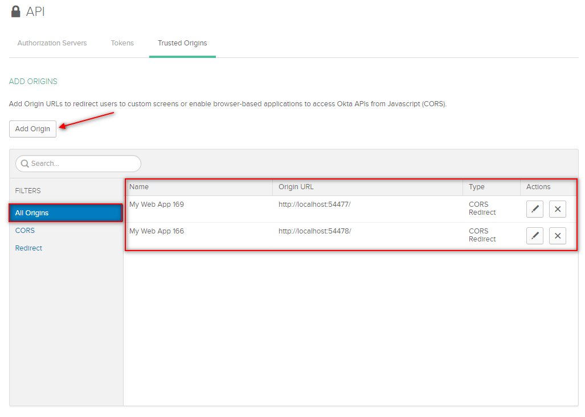

If you skipped that option, you need to add both CAM and Admin Portal base URIs to the trusted origins list. Click **Add Origin** button to open the add origin popup.
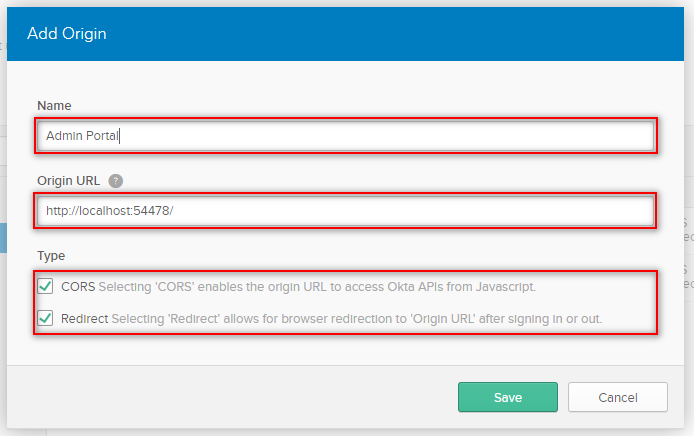
Repeat the action for each origin.

## Apply settings locally
The stage when you need to apply Okta settings locally comes after you unpacked your website to the website physical location (the one that was entered in the IIS Manager settings as the website physical path)

**Admin Portal App Settings**

1. Open the physical path to your Admin website, find `appSettings.Production.json` file.
2. Open this file with any text editor (Notepad, VisualStudio or any other IDE)
3. In the Authentication group of settings you need to set up arguments
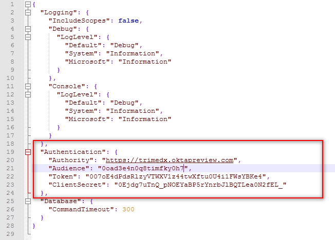
    1. ```"Authority": "https://trimedx.oktapreview.com"``` - this is your Okta domain
    2. ```"Audience": "0oad3e4n0q8timfky0h7"``` - this is your client ID. Client ID you can find in Applications general settings in Okta
    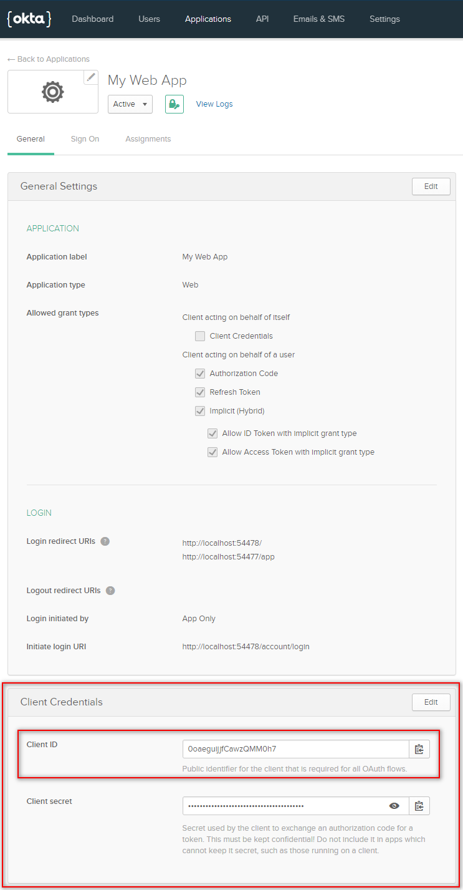
    3. ```"Token": "007oE4dPdsRlzyVTWXV1z44twXftu0U4i1FWsYBKe4"``` - it is possible to copy the token only the moment it was generated, if you don't have a copy of your token or your current toke was compromised, generate a new one, copy it to clipboard and paste here. See how to generate a token below.
    4. ```"ClientSecret": "0Ejdg7uTnQ_pNOEYaBP5rYnrbJlBQTLea0N2fEL_"``` - this is your Client Secret. You can find it in Applications general settings in Okta (see the screenshot for the `"Audience"` argument)
5. Apply changes using **Ctrl + S** shortcut

**CAM Portal App Settings**

1. Open the physical path of your CAM website, find `appsettings.Production.json` file.
2. Open this file with any text editor (Notepad, Visual Studio or any other IDE)
3. In the Authentication group of settings you need to set up arguments
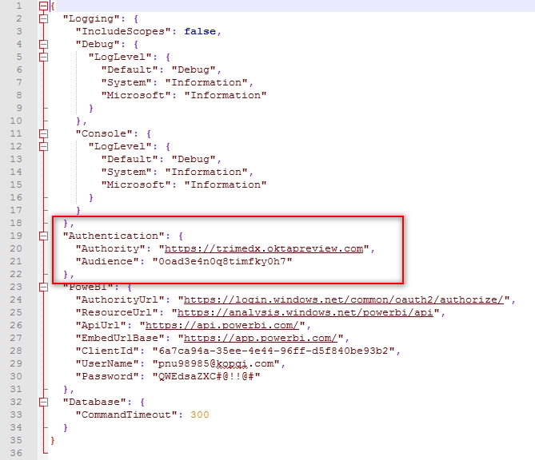
    1. ```"Authority": "https://trimedx.oktapreview.com"``` - this is your Okta domain
    2. ```"Audience": "0oad3e4n0q8timfky0h7"``` - this is your client ID. Client ID you can find in Applications general settings in Okta:
    
4. Apply changes using **Ctrl + S** shortcut

**How to generate a new token**

1. Go to **API** -> **Tokens** 
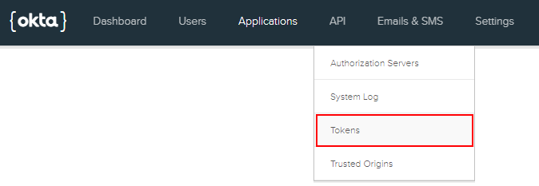
2. Click **Create Token** button
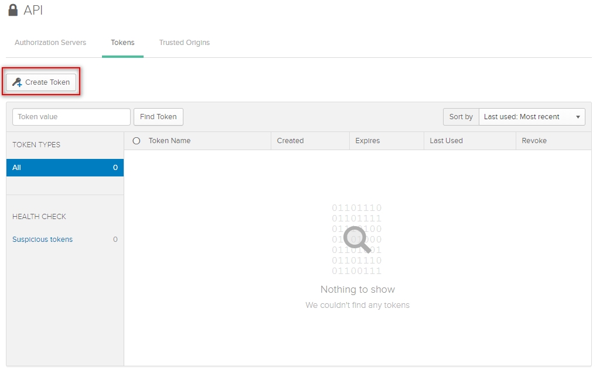
3. In the Create Token popup window enter the name of your token and click **Create token** button

4. This is the only time you see the token value. Copy it to clipboard and paste in the corresponding argument of `appsettings.Production.json` file (see **Admin Portal APP Settings** above)
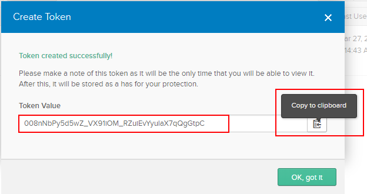

Okta authentication is considered to be integrated into your project the moment you've completed and saved local app settings.
