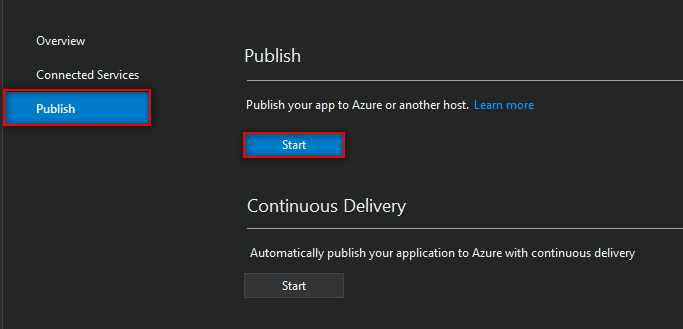
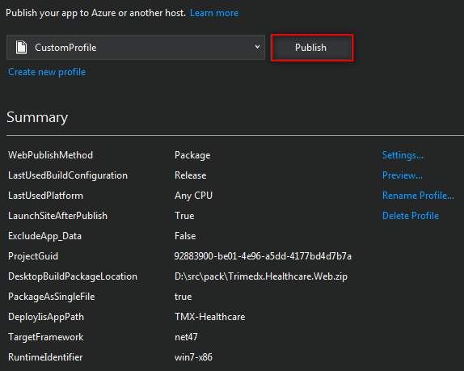
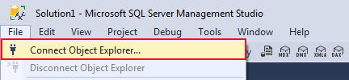
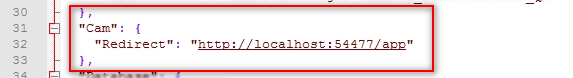
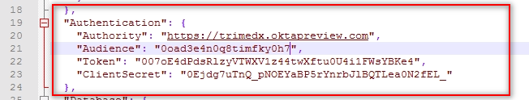
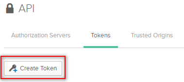

# Walkthrough: how to deploy TriMedX website

In this walkthrough we will go through all the deployment process step by step. Before you start, please, prepare your environment for deployment. The tools and software you will need are listed in the next section

It is also considered that your Okta application is already set up. If not, or you need to verify the settigns, please, see **How To's**: **How to set up Okta configuration** section

>Note: It is strongly recommended to read the whole document before you start deployment to understand how the settings are interconnected and mutually dependent

## Prerequisites

- [Visual Studio 2017 Community](https://www.visualstudio.com/downloads/)
- [.NET Core 2.0.6](https://github.com/dotnet/core/blob/master/release-notes/download-archives/2.0.6-download.md)
- [ASP.NET Core Module for IIS and IIS Express](https://github.com/aspnet/AspNetCoreModule)
- ASP.NET Core will be downloaded while opening the project with Visual Studio (in case it's missing)
- [NodeJS 8.9.1](https://nodejs.org/en/blog/release/v8.9.1/)
- [.NET Framework 4.7](https://www.microsoft.com/en-US/download/details.aspx?id=55167)
- [IIS 7 Manager](https://www.iis.net/downloads/microsoft/iis-manager) if missing
- [Microsoft SQL Server Management Studio 17.5](https://docs.microsoft.com/en-us/sql/ssms/download-sql-server-management-studio-ssms)
- Notepad ++
- GitHub account

## Deployment quide
In this section you will deploy both sites. Bear in mind that most of the steps are the same for each of them. The peculiarities will be described under the subtitles **CAM** for CAM Portal deployment process and **Admin** for Admin Portal deployment process.

### Step 1: Copy repository to your local computer
This is a unified procedure for both sites as they are located in the same repository.

Get access to the [GitHub repository](https://github.com/tmxtaap/TAAP.git) of the project. 

>Ask for an email invitation from the owner of the project to access it

Clone the repository to your local disk. You can choose the most convenient way for you:

  - download a .zip file and extact the repo to the destination you choose on your local computer
  - using an SSH key pair 

*It's recommended to use SSH key pair and Git commands. This approach will help to save time and space on your computer when it comes to the re-deploy procedure* 

>See the **How To's** section in the end of the document for detailed information about how to work with your GitHub repo using GitBash and Git commands

### Step 2: Prepare the project for publication

Open `Trimedx.Healthcare.sln` with Visual Studio 2017. If you have installed the prerequisites correctly, the solution file will open smoothly. Otherwise, Visual Studio will require installation of the missing components.

Open the Solution Explorer from the main menu of the Visual Studio: View -> Solution Explorer


**CAM**

In the Solution Explorer right-click the Trimedx.Healthcare.Web project and select **Publish...** to open the tab with the settings for Publishing


**Admin**

In the Solution Explorer right-click the Trimedx.Healthcare.Admin.Web project and select **Publish...** to open the tab with the settings for Publishing

---
### Step 3: Create your Publish Profile

Each publishing process requires to create the **Publish profile**. It means that you will have two different publishing profiles for CAM and for Admin portals. The profiles' names should show explicitely which website they belong to (CAM or Admin). 

1. In the right-hand side menu choose **Publish**
2. Click **Start** button to initiate creation of a new Publish profile 
3. Pick **IIS, FTP, etc** as a publish target 
4. Click **Create profile** button and configure your profile in the Publish wizard
5. In **Connection** tab 

    1. Select the publishing method: `Web deploy package` 
    2. Choose the package location. You can either use an existing folder or create a new folder for it. 
    3. Add your site name, e.g., 'Tmx-Healthcare'. You will use this site name while creating a website with IIS Manager
6. In **Settings** tab:

    1. Choose configuration purpose: **Release** for production
    2. Target framework: net47
    3. Choose Target runtime depending on the OS
7. Click **Save** to save changes and close the wizard


---
### Step 4: Build your project

When you are done with Publish Profile settings, click **Publish** button. The package building process will start 


If your build process finished successfully, in the destination folder of your CAM portal package you will find the following files:

**CAM**

- Trimedx.Healthcare.Web.deploy.cmd
- Trimedx.Healthcare.Web.deploy-readme.txt
- Trimedx.Healthcare.Web.Parameters.xml
- Trimedx.Healthcare.Web.SetParameters.xml
- Trimedx.Healthcare.Web.SourceManifest.xml
- Trimedx.Healthcare.Web.zip

**Admin**

- Trimedx.Healthcare.Web.Admin.deploy.cmd
- Trimedx.Healthcare.Web.Admin.deploy-readme.txt
- Trimedx.Healthcare.Web.Admin.Parameters.xml
- Trimedx.Healthcare.Web.Admin.SetParameters.xml
- Trimedx.Healthcare.Web.Admin.SourceManifest.xml
- Trimedx.Healthcare.Web.Admin.zip

---
### Step 5: Create a website using IIS manager

A Web site is a container for Web applications, and you can access it through one or more unique bindings. A Web site binding is the combination of an IP address, a port, and the optional host headers on which HTTP.sys listens for requests made to that Web site. Web site bindings use the HTTP or HTTPS protocols. You can create Web sites and share information with users on the Internet, an intranet, or an extranet.

You will create one website for CAM portal and one website for Admin portal

Open **Internet Information Services (IIS) Manager**


>If you want to learn more about IIS manager functionality, please, reach out [Microsoft official documentation](https://docs.microsoft.com/en-us/previous-versions/windows/it-pro/windows-server-2008-R2-and-2008/cc732976(v=ws.10))

In the **Connections** pane, right-click the **Sites** node in the tree, and then click **Add Web Site** menu item


>Note that the site name you added when configured the Publish profile in Visual Studio (see Step 3) should be the same as the site name you've created via IIS manager


In the **Add Web Site** dialog box


1. Type a name for your Website in the **Site name** field.
2. Click Select if you want to select a different application pool than the one listed in the **Application Pool** box. In the **Select Application Pool** dialog box, select an application pool from the Application Pool list and then click OK.
    1. The application pool parameters: *ASP.NET v4*; Pipeline mode: *Integrated*
3. In the **Physical path** box, type the physical path of the Web site's folder (that's where your website will be physically located), or click the browse button (...) to navigate the file system to find or create the folder.
4. In the **Binding** group of settings, choose the binding type, IP address (if needed), and a port. The port should be present in the **base URI** of the CAM Portal or Admin Portal (depending on what website you are going to deploy) and listed in **Trusted origins** in Okta configuration
5. If you want the Web site to be immediately available, tick the Start Web site immediately check box.
6. Click **OK**

> If you need to set up a hostname that is different from the name of your local machine, ask your network administrator to provide you with the hostname and DNS

---
### Step 6: Add environment variables
Environment variables are strings that contain information such as file name or path. These variables control the behavior of various programs on a computer. Value of environment variables depends on the environment of the website that you are deploying (*Staging* or *Production*). In this documentation we show how to set up Production environment.

The settings for CAM and Admin Portal are identical, but you will need to add the environmental variable to every site.

1. Open **Configuration Editor** of the website from the central field of the IIS Manager


2. Check the **Section** field, it should show ASP NET Core settings: `system.webServer/aspNetCore`

3. Choose **Environment Variables** 


4. Click **Add** in the right-hand sidebar 


5. Edit the input fields to add name and value


    1. Type in the name input field ```ASPNETCORE_ENVIRONMENT``` 
    2. Type in the value input field ```Production```
    3. Close the window
6. Click **Apply** in the right-hand sidebar

---
### Step 7: Unpack your website

In this step you will literally deploy your website. It means that you will run your package file and autopopulate your website destination. 

1. Open the Command Prompt application (right-click on the application and choose 'Run as administrator')
    1. Start -> All Programs -> System tools -> Command Prompt (for Windows 7)
    2. or search using `cmd` keyword in the Windows search box (for Windows X)
2. Open the scenario file using the command ``` "D:\site build\Trimedx.Healthcare.Web.deploy.cmd" /Y```; or you can simply drag-and-drop your it in the Commant Prompt window. The command similar to the one above will appear.
 
3. The ` /Y` flag deploys the package to the current machine (or destination server). Add this flag (upper case required) next to the file location address.
4. Hit **Enter**

The file will be launched 
 
 **CAM**

Instead of D:\site build\ use your path to the file `Trimedx.Healthcare.Web.deploy.cmd`

**Admin**

Instead of D:\site build\ use your path to the file `Trimedx.Healthcare.Web.Admin.deploy.cmd`


>You can ensure that you've done everything correctly if you return to IIS Manager and refresh Connections pane (right-click in the Connections pane and choose **Refresh**). Your website node will have several additional folders in the tree below

---
### Step 8: Open your website in a browser

1. Open IIS Manager
2. Choose your website
3. Check the left-hand side menu **Manage website** group to ensure the website is running, click **Start** button if needed
4. In the left-hand side menu of the IIS manages (with your website selected), choose the Browse website menu group and select the corresponding link


>Note that at the current stage you won't be able to log in because there's no connection to the database. We will set it up in the next steps

---
### Step 9: Connect to the SQL Server

Requirements:

- SQL Server Management Studio 17.5
- Ensure the database server is accessible

To set connections between your website and the database you will need to 

1. Open **SQL Server Management Studio 17.5**
2. In the main menu click File -> Connect Object Explorer 

3. In the **Connect to Server** popup  

    1. Type in your local database server name
    2. Choose `SQL Server Authentication` in **Authentication** dropdown
    3. Use proper credentials to get access to the server
6. Click **Connect**
7. If succeeded, you will see the unfolded tree with the database objects located at the server

>Note: If your databases are located on the same server, the credentials will be similar for both **CAM** and **Admin** databases. Ask your system administrator for details

---
### Step 10: Create your database

You will need to create a separate database for **CAM** and **Admin** portals

1. In **Object Explorer** pane, right-click **Databases** node and choose **New Database** 
2. Type in the name of your database and click **OK**. Choose the name theat will explicitely show which portal it belongs to, e.g. *camsql* for CAM and *adminsql* for Admin


---
### Step 11: Populate your database with objects and data
**CAM**

1.  In the repository you have downloaded to your local machine (src -> Trimedx.Healthcare.DB) find the files:
    1. CAMDDLScript.sql
    2. CAMDDLUpdate.sql
    3. SP.sql
2. Open them in the SQL Server Management Studio (either drag & drop them to the SQL Server Management Studio window or open from the main menu File -> Open -> browse window)
3. Select the database you created in the control panel dropdown. This action indicates the execution context 
4. Execute them in the exact order stated above by pressing the F5 button or **Execute** button  in the control panel
5. Enter login and password every time you are prompted

> Check the execution context before you execute the scripts to ensure that you populate the correct database

**Admin**

1. In the repository you have downloaded to your local machine (src -> Trimedx.Healthcare.DB -> CAM Portal) find the files:
    1. CAMPortalDDLScript.sql
    2. CAMPortalDDLUpdate.sql
    3. SP.sql
    4. CAMPortalInsertsTest.sql
2. Open them in the SQL Server Management Studio (either drag & drop them to the SQL Server Management Studio window or open from the main menu File -> Open -> browse window)
3. Select the database you created in the control panel dropdown. This action indicates the execution context 
4. Execute them in the exact order stated above by pressing the F5 button or Execute button  in the control panel

> Check the execution context before you execute each script to ensure that you populate the correct database

---
### Step 12-CAM: Update parameters

>This step is relevant only for **CAM** Portal deployment

In this step we set up parameters that a scenario file will need in order to populate your database with data. 

1. Find the run_params.bat file in the repository you have downloaded to your local machine (src -> Trimedx.Healthcare.DB -> CAMInserts -> run_params.bat)
2. Open this file with Notepad or any other text editor

3. Substitute the sample parameters in the file with the parameters you use, including the Database name you added above
4. Save changes using **Ctrl + S** shortcut

---
### Step 13-CAM: Populate your database with data

>This step is relevant only for **CAM** Portal deployment

1. In the same folder (src -> Trimedx.Healthcare.DB -> CAMInserts -> run_params.bat) find run.bat file
2. Open the Command Prompt
3. Change directory to the one where the file is located, e.g. `cd D:\repos\trimedx-master-320\src\Trimedx.Healthcare.DB\CAMInserts` 
3. Drag and drop to the Command Prompt run.bat file and press **Enter**
4. The Command Prompt will show logs of updated rows

---
### Step 14: Update connection parameters

In this step you wil set up connection to the Admin Database. 


**CAM**

1. Open your website physical path (the one you indicated in the IIS Manager settings; see **Step 5**), find the file 'dbConnectionSettings.Production.json'. 
2. Open it with any IDE or text editor (e.g., Notepad)
3. Replace the values with the relevant to Admin Portal database parameters:
    1. server, e.g. server=n1670 - server name where your Admin DB is located (if different from CAM DB server)
    2. User Id, e.g. User Id=camsql - User ID needed to access to your Admin DB (if different from CAM DB server)
    3. Password, e.g. Password=12345 - Password needed to access to your Admin DB (if different from CAM DB server)
    4. Database, e.g. database=adminsql101 - Your Admin database name
4. Save changes using **Ctrl + S** shortcut

>Note: If you want to add an SQL instance (corresponds to the `SQLINST` parameter in run_params.bat), add it to the server, placing double back-slashes after the server name, e.g. `server=n1670\\mssql2014dev`

**Admin**

1. Open your website physical path (the one you indicated in the IIS Manager settings; see **Step 5**), find the file 'dbConnectionSettings.Production.json'
2. Open it with any IDE or text editor (e.g., Notepad)
3. Replace the values with the relevant ones:
    1. server, e.g. server=n1670
    2. User Id, e.g. User Id=camsql
    3. Password, e.g. Password=12345
    4. Database, e.g. database=adminsql101
4. Save changes using **Ctrl + S** shortcut

>Note: If you want to add an SQL instance, add it to the server, placing double back-slashes after the server name, e.g. `server=n1670\\mssql2014dev`

---
### Step 15: Setup redirect

**CAM**

Make your CAM Portal communicate with Admin Portal correctly.

1. Open your website physical path (the one you indicated in the IIS Manager settings; see **Step 5**), find the file 'appsettings.Production.json'
2. Open it with any IDE or text editor (e.g., Notepad)
3. In the ```"Admin"``` group of settings you need to set up argument 
``` "AdminUrl": "http://localhost:54478"```
It means that the `localhost:54478` should be substituted with the relevant to your Admin login redirect URI: `address:port`


**Admin**

Make your Admin Portal communicate with CAM Portal correctly.

1. Open your website physical path (the one you indicated in the IIS Manager settings; see **Step 5**), find the file 'appsettings.Production.json'
2. Open it with any IDE or text editor (e.g., Notepad)
3. In the ```"Cam"``` group of settings you need to set up argument 
```"Redirect": "http://localhost:54477/app"```
It means that the `localhost:54477` should be substituted with the relevant to you CAM login redirect URI: `address:port` and after it added `/app`


### Step 16: Apply Okta settings locally

**CAM**

1. Open the physical path of your CAM website, find `appsettings.Production.json` file.
2. Open this file with any text editor (Notepad, Visual Studio or any other IDE)
3. In the **Authentication** group of settings you need to set up arguments

    1. ```"Authority": "https://trimedx.oktapreview.com"``` - this is your Okta domain
    2. ```"Audience": "0oad3e4n0q8timfky0h7"``` - this is your client ID. Client ID you can find in Applications general settings in Okta:
    
4. Apply changes using **Ctrl + S** shortcut


**Admin**

1. Open the physical path to your Admin website, find `appSettings.Production.json` file.
2. Open this file with any text editor (Notepad, VisualStudio or any other IDE)
3. In the **Authentication** group of settings you need to set up arguments

    1. ```"Authority": "https://trimedx.oktapreview.com"``` - this is your Okta domain
    2. ```"Audience": "0oad3e4n0q8timfky0h7"``` - this is your client ID. Client ID you can find in Applications general settings in Okta
    
    3. ```"Token": "007oE4dPdsRlzyVTWXV1z44twXftu0U4i1FWsYBKe4"``` - it is possible to copy the token only the moment it was generated, if you don't have a copy of your token or your current toke was compromised, generate a new one, copy it to clipboard and paste here. See how to generate a token below.
    4. ```"ClientSecret": "0Ejdg7uTnQ_pNOEYaBP5rYnrbJlBQTLea0N2fEL_"``` - this is your Client Secret. You can find it in Applications general settings in Okta (see the screenshot for the `"Audience"` argument)
5. Apply changes using **Ctrl + S** shortcut


---
### Step 16: Launch your website

Browse your website from **IIS Manager**

---
## Update or re-deploy your websites
If any changes in the source code occur you need to redeploy them to the production website. Before you deploy any changes, make sure they don't influence the stability of the Portal (test and debug them first). The deployment process remains the same, it is the safest way to keep the code and data integrity: the changes will be included in the new deploy package built by the Visual Studio Publish feature.

---
*Update your source code:*

1. Open Git Bash
2. Navigate to the directory with your repo (enter `cd '~/tmxsource'`, where '~/tmxsource' is the address to the folder with the source code)
3. Enter `git fetch origin && git merge origin`. The directory with the source code will be updated with the newest changes

>Download a new .zip if this method is preferable for you

---
*Build a package using the Visual Studio one-click publish feature.*

See **Step 2**,  **Step 3** and **Step 4** for details

---
You will *not need to make any changes to the website in the IIS Manager*. You should Stop the website for the re-deploy period

---
If your database scripts were changed, *execute the new scripts*. To do so, repeat actions listed in **Step 11** 

---
*Check your connection parameters* in the file 'dbConnectionSettings.Production.json'. See **Step 14** for details

---
*Check your environment variable for presence*, add it anew if missing. See **Step 6**

---
*Check your redirect settings* in the file 'appsettings.Production.json'. See **Step 15** for details

---
*Restart your website from the IIS Manager* left sidebar, see **Step 7** for details

---
*Browse your website* from IIS, see **Step 8**

## How To's

### How to set up Okta configuration

In this section you will configue authorization presets in Okta web interface.

*Requirements:*

- Okta account

#### Sign Up for Okta

You’ll need a free Okta developer organization to get started. Current TriMedX Okta developer organization: https://trimedx.oktapreview.com
Ask your system engeneer for credentials.

If you don’t have one, sign up to create it here: https://developer.okta.com/signup/
When you create a new Okta organization, it will be assigned a base URL like `dev-12345.oktapreview.com`. This is your unique subdomain in Okta. `oktapreview.com` organizations are production-ready and can be used for development work or full-fledged apps.


#### Set up and configure your application

The settings that you will tune in this section are interconnected with the deployment IIS Manager settings. It means, that the sites and ports you enter here should be the same as the sites and ports you enter in your IIS Manager setup. 

>Note: An **Application** for https://trimedx.oktapreview.com developer account is already set up, please, look through the settings and varify them. Click **Edit** button next to the active application in **Applications** list. 

1. Open **Applications** menu
2. Click **Add application** button
 
3. Choose **WEB** container and click **Next**
 
4. Add **Base URIs**. These are the domains where your application runs. Trusted Origins will be created for these URIs automatically, and will be the only domains Okta accepts API calls from. Use your CAM Portal URI (e.g., http://localhost:54477/) and Admin Portal URI (e.g., http://localhost:54478/) including ports that will be used during the deployment procedure.


5. **Login redirect URIs**
    1. Add base Admin Portal URI, e.g. http://localhost:54478/  
    2. Add CAM Portal login redirect, e.g. http://localhost:54477/app. Substitute `localhost:54477` with the relevant `address:port` and add `/app` after it


6. For **Grant type allowed** tick
    1. 'Authorization Code'
    2. 'Refresh Token'
    3. 'Implicit (Hybrid)'


7. Click **Done**

Your application will appear in the list. You can easily access it by click on **Applications** menu item in the header

Choose your app in the list of applications to tune its settings, click **Edit** to add settings that were not included into the initial configuration

1. In the **Allowed grant types** group of settings, tick **Allow Access Token with implicit grant type**

2. In the **Initiate login URI** field, add login URI for Admin portal, e.g. http://localhost:54478/account/login. Substitute `localhost:54478` with the relevant `address:port` and add `/account/login` after it 

3. Click **Save** button to apply settings

In the next step you need to check the Trusted Origins. Click **API** menu item in the header and choose **Trusted origins** from the dropdown 


If you added **Base URIs** while setting up your application, the trusted origins will be on the list. 


If you skipped that option, you need to add both CAM and Admin Portal base URIs to the trusted origins list. Click **Add Origin** button to open the **Add origin** popup.

Repeat the action for each origin (website).

Later, when the website is deployed, you will apply these settings locally by editing .json configuration files.

#### How to generate a new token with via Okta

Open Okta web interface (e.g., https://trimedx.oktapreview.com)

1. Go to **API** -> **Tokens** 


2. Click **Create Token** button


3. In the Create Token popup window enter the name of your token and click **Create token** button


4. This is the only time you see the token value. Copy it to clipboard and paste in the corresponding argument of `appsettings.Production.json` file (see **Admin Portal APP Settings** above)


Okta authentication is considered to be integrated into your project the moment you've completed and saved local app settings.

### How to add an SSH key to your GitHub account

**Requirements:** 

- GitBash

#### Check for existing SSH keys

Before you generate an SSH key, you can check to see if you have any existing SSH keys.

1. Open Git Bash.
2. Enter `ls -al ~/.ssh` to see if existing SSH keys are present
3. Check the directory listing to see if you already have a public SSH key.
By default, the filenames of the public keys are one of the following:

id_dsa.pub
id_ecdsa.pub
id_ed25519.pub
id_rsa.pub

#### Generate a new SSH key

If you don't have an existing public and private key pair, or don't wish to use any that are available to connect to GitHub, then generate a new SSH key.

1. Open Git Bash.
2. Paste the text below, substituting in your GitHub email address
`ssh-keygen -t rsa -b 4096 -C "your_email@example.com"` This command creates a new ssh key, using the provided email as a label.
3. When you're prompted to "Enter a file in which to save the key," press Enter. This accepts the default file location.
4. At the prompt, type a secure passphrase. Press Enter if you will work without a passphrase.


#### Add a new SSH key to your GitHub account

1. Open Git Bash.
2. Enter `clip < ~/.ssh/id_rsa.pub` to copy the SSH key to your clipboard.
3. In the upper-right corner of any page, click your profile photo, then click **Settings**.


4. In the user settings sidebar, click **SSH and GPG keys**.


5. Click **New SSH key** or **Add SSH key**.


6. In the **Title** field, add a descriptive label for the new key.
7. Paste your key into the **Key** field.


8. Click **Add SSH key**.
9. If prompted, confirm your GitHub password.


#### How to clone repo using the SSH-key pair

1. Open your project in GitHub
2. Click **Clone or download**


3. Choose **Clone with SSH** if it's not selected by default
4. Click **Copy to clipboard**
4. Open Git Bash
5. Choose directory where your repo will be located: enter `cd '~/tmxsource'`, where '~/tmxsource' is the directory to the folder with the source code
6. Enter `git clone` and paste the SSH you've copied earlier next to with **Shift + Insert** shortcut
7. Press **Enter**. The repo will be downloaded to the designated folder