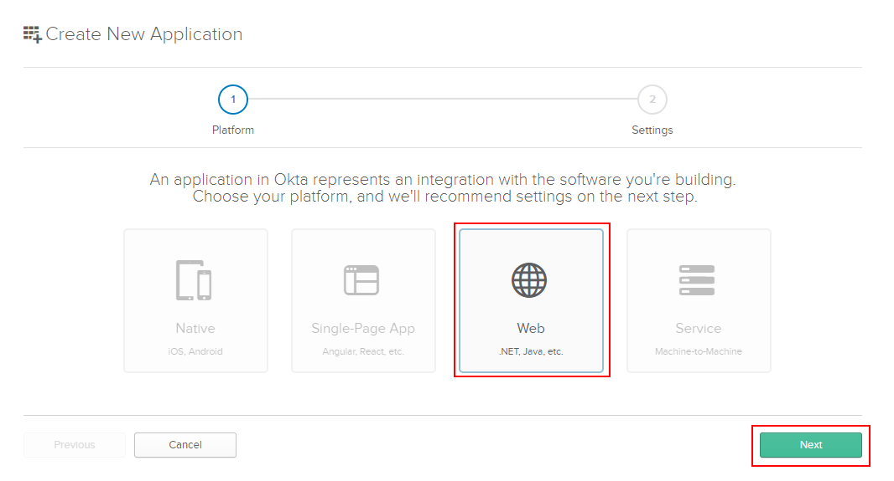

# Walkthrough: how to deploy TriMedX website

In this walkthrough we will go through all the deployment process step by step. Before you start, please, prepare your environment for deployment. The tools and software you will need are listed in the next section

>Note: It is strongly recommended to read the whole document before you start deploying to understand how the settings are interconnected and mutually dependent

## Prerequisites

- The latest version of [Visual Studio 2017 Community](https://www.visualstudio.com/downloads/)
- [.NET Core 2.0.6](https://github.com/dotnet/core/blob/master/release-notes/download-archives/2.0.6-download.md)
- .ASP.NET Core will be downloaded while opening the project with Visual Studio (in case it's missing)
- [NodeJS 8.9.1](https://nodejs.org/en/blog/release/v8.9.1/)
- [.NET Framework 4.7](https://www.microsoft.com/en-US/download/details.aspx?id=55167)
- [Git Bash](https://git-scm.com/downloads) (for Windows use default installation presets)
- [IIS 7](https://www.iis.net/downloads/microsoft/iis-manager) if missing
- [Microsoft SQL Server Management Studio 17.5](https://docs.microsoft.com/en-us/sql/ssms/download-sql-server-management-studio-ssms)
- Notepad
- GitHub account
- Okta developer account (see below how to set it up)

## Okta configuration
In this section you will configue authorization presets in Okta web interface. Configuring Okta in advance will allow us to use ports designated as trusted.

## Sign Up for Okta
You’ll need a free Okta developer organization to get started. 

TriMedX Okta developer organization: https://trimedx.oktapreview.com
Ask your network administrator for credentials.

If you don’t have one already, sign up to create one here https://developer.okta.com/signup/
When you create a new Okta organization, it will be assigned a base URL like `dev-12345.oktapreview.com`. This is your unique subdomain in Okta. `oktapreview.com` organizations are production-ready and can be used for development work or full-fledged apps.

## Set up and tweak an application

The settings that we tune in this section are interconnected with the deployment IIS MAnagement settings. It means, that the sites and ports you enter here should be the same as the sites and ports you enter in IIS Manager setup. 

>Note: If an **Application** for https://trimedx.oktapreview.com developer account is already set up, please, look through the settings and varify them. 

1. Open **Applications** menu
2. Click **Add application** button
)
3. Choose **WEB** container and click **Next**

4. Add **Base URIs**. These are the domains where your application runs. Trusted Origins will be created for these URIs automatically, and will be the only domains Okta accepts API calls from. Use your CAM Portal URI and Admin Portal URI including ports that will be used during the deployment procedure. 
Example: 
http://localhost:54478/ (Admin)
http://localhost:54477/ (CAM)

5. **Login redirect URIs**:
    1. Add base Admin Portal URI, e.g. http://localhost:54478/
    2. Add CAM Portal login redirect, e.g. http://localhost:54477/app. It means that the `localhost:54477` should be substituted with the relevant `address:port` and after it added `/app`
6. For **Grant type allowed** tick
    1. 'Authorization Code'
    2. 'Refresh Token
    3. 'Implicit (Hybrid)''
7. Click **Done**

Your application will appear in the list. You can easily access it by click on **Applications** menu item in the header

Choose your app in the list of applications to tweak its settings, click **Edit** to add settings that are not included into the initial configuration

1. In the **Allowed grant types** group of settings, tick **Allow Access Token with implicit grant type**
2. In the **Initiate login URI**, add login URI for Admin portal, e.g. http://localhost:54478/account/login. It means that the `localhost:54478` should be substituted with the relevant `address:port` and after it added `/account/login`

