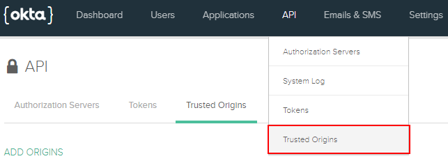
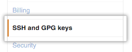
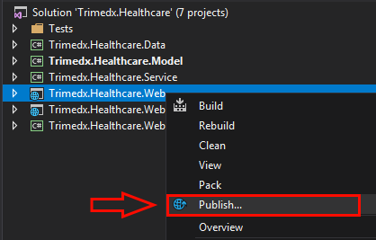

# Walkthrough: how to deploy TriMedX website

In this walkthrough we will go through all the deployment process step by step. Before you start, please, prepare your environment for deployment. The tools and software you will need are listed in the next section

>Note: It is strongly recommended to read the whole document before you start deploying to understand how the settings are interconnected and mutually dependent

## Prerequisites

- The latest version of [Visual Studio 2017 Community](https://www.visualstudio.com/downloads/)
- [.NET Core 2.0.6](https://github.com/dotnet/core/blob/master/release-notes/download-archives/2.0.6-download.md)
- .ASP.NET Core will be downloaded while opening the project with Visual Studio (in case it's missing)
- [NodeJS 8.9.1](https://nodejs.org/en/blog/release/v8.9.1/)
- [.NET Framework 4.7](https://www.microsoft.com/en-US/download/details.aspx?id=55167)
- [Git Bash](https://git-scm.com/downloads) (for Windows use default installation presets)
- [IIS 7](https://www.iis.net/downloads/microsoft/iis-manager) if missing
- [Microsoft SQL Server Management Studio 17.5](https://docs.microsoft.com/en-us/sql/ssms/download-sql-server-management-studio-ssms)
- Notepad
- GitHub account
- Okta developer account (see below how to set it up)

## Okta configuration
In this section you will configue authorization presets in Okta web interface. Configuring Okta in advance will allow you to use designated ports in further setup.

## Sign Up for Okta
You’ll need a free Okta developer organization to get started. 

TriMedX Okta developer organization: https://trimedx.oktapreview.com
Ask your network administrator for credentials.

If you don’t have one already, sign up to create it here: https://developer.okta.com/signup/
When you create a new Okta organization, it will be assigned a base URL like `dev-12345.oktapreview.com`. This is your unique subdomain in Okta. `oktapreview.com` organizations are production-ready and can be used for development work or full-fledged apps.

## Set up and tweak an application

The settings that we tune in this section are interconnected with the deployment IIS Manager settings. It means, that the sites and ports you enter here should be the same as the sites and ports you enter in your IIS Manager setup. 

>Note: If an **Application** for https://trimedx.oktapreview.com developer account is already set up, please, look through the settings and varify them. 

1. Open **Applications** menu
2. Click **Add application** button
)
3. Choose **WEB** container and click **Next**

4. Add **Base URIs**. These are the domains where your application runs. Trusted Origins will be created for these URIs automatically, and will be the only domains Okta accepts API calls from. Use your CAM Portal URI and Admin Portal URI including ports that will be used during the deployment procedure. 

Example: 

http://localhost:54478/ (Admin)

http://localhost:54477/ (CAM)

5. **Login redirect URIs**:
    1. Add base Admin Portal URI, e.g. http://localhost:54478/
    2. Add CAM Portal login redirect, e.g. http://localhost:54477/app. Substitute `localhost:54477` with the relevant `address:port` and add `/app` after it
6. For **Grant type allowed** tick
    1. 'Authorization Code'
    2. 'Refresh Token
    3. 'Implicit (Hybrid)''
7. Click **Done**

Your application will appear in the list. You can easily access it by click on **Applications** menu item in the header

Choose your app in the list of applications to tune its settings, click **Edit** to add settings that were not included into the initial configuration

1. In the **Allowed grant types** group of settings, tick **Allow Access Token with implicit grant type**
2. In the **Initiate login URI**, add login URI for Admin portal, e.g. http://localhost:54478/account/login. Substitute `localhost:54478` with the relevant `address:port` and add `/account/login` after it 

In the next step you need to check the Trusted Origins. Click **API** menu item in the header and choose **Trusted origins** from the dropdown 

If you added **Base URIs** while setting up your application, the trusted origins will be on the list. 

If you skipped that option, you need to add both CAM and Admin Portal base URIs to the trusted origins list. Click **Add Origin** button to open the **Add origin** popup.

Repeat the action for each origin (website).

Later, when the website is deployed, you will apply these settings locally by editing .json configuration files.

## Deployment quide
In this section you will deploy both sites. Bear in mind that most of the steps are the same for each of them. The peculiarities will be described under the subtitles **CAM** for CAM Portal deployment process and **Admin** for Admin Portal deployment process.

### Step 1: Copy repository to your local computer
This is a sole procedure for both sites as they are located in the same repository.

Get access to the [GitHub repository](https://github.com/tmxtaap/TAAP.git) of the project. 

>Ask for an email invitation from the owner of the project to access it

Clone the repository to your local disk. You can choose the most convenient way for you
  - using an SSH key pair (see the instruction below); 
  - via https link;
  - download a .zip file and extact the repo to the destination you choose on your local computer

*It's recommended to use SSH key pair and Git commands. This approach will help to save time and space on your computer when it will come to the re-deploy procedure* 

>Consult [GitHub help page](https://help.github.com/articles/cloning-a-repository/) if needed 

---
#### How to add an SSH key to your GitHub account

---
**Check for existing SSH keys**

Before you generate an SSH key, you can check to see if you have any existing SSH keys.

1. Open Git Bash.
2. Enter `ls -al ~/.ssh` to see if existing SSH keys are present
3. Check the directory listing to see if you already have a public SSH key.
By default, the filenames of the public keys are one of the following:

id_dsa.pub
id_ecdsa.pub
id_ed25519.pub
id_rsa.pub

---
**Generate a new SSH key**

If you don't have an existing public and private key pair, or don't wish to use any that are available to connect to GitHub, then generate a new SSH key.

1. Open Git Bash.
2. Paste the text below, substituting in your GitHub email address
`ssh-keygen -t rsa -b 4096 -C "your_email@example.com"` This creates a new ssh key, using the provided email as a label.
3. When you're prompted to "Enter a file in which to save the key," press Enter. This accepts the default file location.
4. At the prompt, type a secure passphrase. Press Enter if you will work without a passphrase.

---
**Add a new SSH key to your GitHub account**

1. Open Git Bash
2. Enter `clip < ~/.ssh/id_rsa.pub` to copy the SSH key to your clipboard.
3. In the upper-right corner of any page, click your profile photo, then click **Settings**.

4. In the user settings sidebar, click **SSH and GPG keys**.

5. Click **New SSH key** or **Add SSH key**.

6. In the "Title" field, add a descriptive label for the new key.
7. Paste your key into the "Key" field.

8. Click **Add SSH key**.
9. If prompted, confirm your GitHub password.

---
#### How to clone repo using the SSH-key pair

1. Open your project in GitHub
2. Click **Clone or download**

3. Choose 'Clone with SSH' if it's not selected by default
4. Click 'Copy to clipboard'
4. Open git Bash
5. Choose directory where your repo will be located: enter `cd '~/tmxsource'`, where '~/tmxsource' is the directory to the folder with the source code
6. Enter `git clone` and paste the SSH you've copied earlier next to with **Shift + Insert** shortcut
7. Press **Enter**. The repo will be downloaded to the designated folder

### Step 2: Prepare the project for publication

Open `Trimedx.Healthcare.sln` with Visual Studio 2017. If you have installed the prerequisites correctly, the solution file will be opened smoothly. Otherwise, Visual Studio will require installing the missing components.

Open the Solution Explorer
>You can do it from the main menu of the Visual Studio: View -> Solution Explorer or using hotkeys Ctrl + W, S (consecutively)

**CAM**
In the Solution Explorer right-click the Trimedx.Healthcare.Web project and select Publish to open the **Publish Web** tab

**Admin**
In the Solution Explorer right-click the Trimedx.Healthcare.Admin.Web project and select Publish to open the **Publish Web** tab